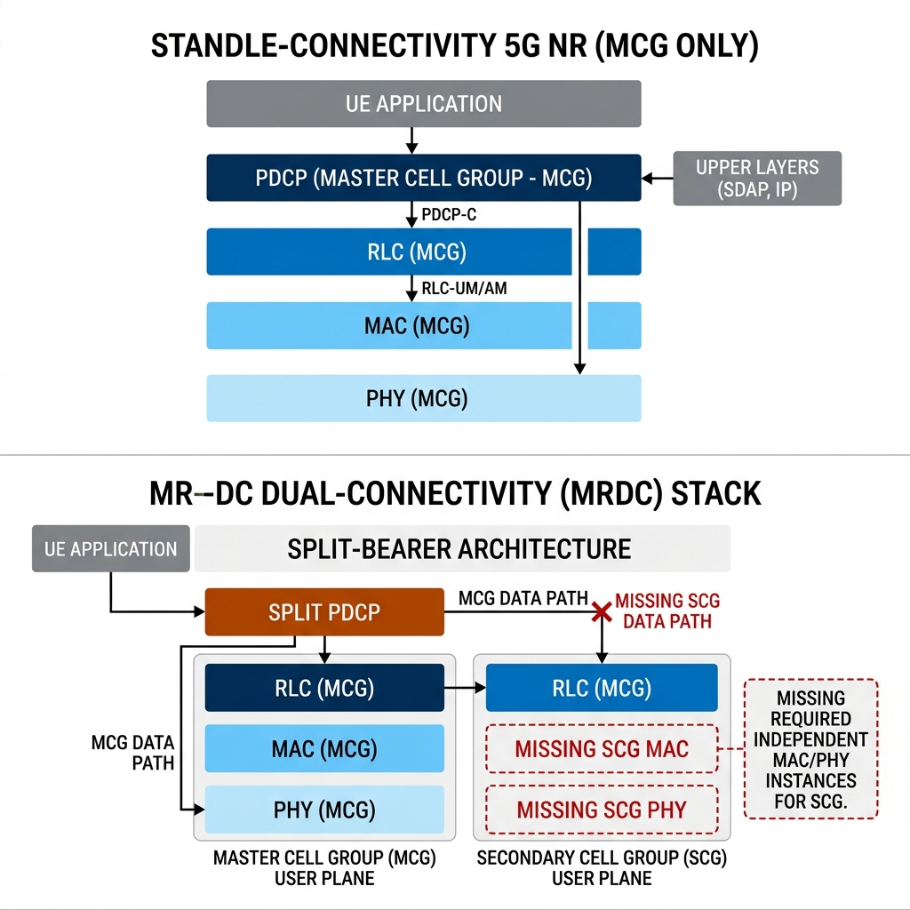

# Multi-Connectivity (MR-DC) and NTN Implementation Analysis

**Date:** 2026-06-22  
**Status:** Documented Analysis  

---

## 🎯 Goal
This document explains the current state of **Multi-Radio Dual Connectivity (MR-DC)** and **Non-Terrestrial Networks (NTN)** within the standalone 5G SA testbed (consisting of the `oCUDU` gNB and `srsue` simulator), detailing why these features are not currently implemented, along with references to the codebase.

---

## 🔍 1. Multi-Radio Dual Connectivity (MR-DC)

MR-DC (such as EN-DC or NR-DC) allows a User Equipment (UE) to connect to two cell towers simultaneously: a **Master Cell Group (MCG)** and a **Secondary Cell Group (SCG)**. This requires protocol layers (especially MAC and PHY) to manage multiple carrier aggregations/transceivers concurrently.

### Why MR-DC is Not Implemented
1. **Single-Connectivity Stack Architecture in `srsue`:**  
   The UE stack is designed around a single MCG structure. In [ue_stack_nr.h](file:///root/internship-repo/project/srsRAN_4G/srsue/hdr/stack/ue_stack_nr.h#L143-L149), stack components are instantiated as individual, singular variables representing the master cell group:
   ```cpp
   // stack components
   std::unique_ptr<mac_nr>       mac;
   std::unique_ptr<rrc_nr>       rrc;
   std::unique_ptr<srsran::rlc>  rlc;
   std::unique_ptr<srsran::pdcp> pdcp;
   std::unique_ptr<srsue::sdap>  sdap;
   ```
   To support MR-DC, the stack must manage dual MAC entities and coordinate dual radio pathways, which is completely absent.

2. **SCell and SCG Absence in UE MAC:**  
   A search through the UE's NR MAC layer source files (`project/srsRAN_4G/srsue/src/stack/mac_nr/`) yields **zero results** for Secondary Cells (`SCell`) or SCG handling. 

3. **Unhandled SCG Reconfiguration in UE RRC:**  
   In [rrc_nr_procedures.cpp:L39-L73](file:///root/internship-repo/project/srsRAN_4G/srsue/src/stack/rrc_nr/rrc_nr_procedures.cpp#L39-L73), the UE's connection reconfiguration procedure unpacks the secondary cell group configuration (`secondary_cell_group_cfg`) and calls `apply_cell_group_cfg`, but the PHY control logic lacks real support to configure the second RF front-end/carrier:
   - In [rrc_nr_procedures.cpp:L142-L146](file:///root/internship-repo/project/srsRAN_4G/srsue/src/stack/rrc_nr/rrc_nr_procedures.cpp#L142-L146), we find comments indicating missing SCell PHY control:
     ```cpp
     // TODO phy ctrl
     // in case there are scell to configure, wait for second phy configuration
     // if (not rrc_ptr->phy_ctrl->is_config_pending()) {
     //   return proc_outcome_t::yield;
     // }
     ```
   - In [rrc_nr.cc:L2009-L2013](file:///root/internship-repo/project/srsRAN_4G/srsue/src/stack/rrc_nr/rrc_nr.cc#L2009-L2013), we find comments regarding missing bearer releases/routing logic for EN-DC operation:
     ```cpp
     // TODO
     //  2>  if the UE is operating in EN-DC
     // 3>  if a new bearer is not added either with NR or E-UTRA with same eps-BearerIdentity:
     // 4>  indicate the release of the DRB and the eps-BearerIdentity of the released DRB to upper layers.
     ```

4. **Missing gNB SCG/Secondary Node Operations in `ocudu`:**  
   While the gNB includes ASN.1 structs for F1AP and XnAP dual-connectivity signaling, a search in `ocudu/lib` (excluding ASN.1 generated code) shows that the active gNB/CU/DU stack has no logic for secondary node addition, modification, or split-bearer routing.

### Architectural Diagram (MR-DC vs Single Connectivity)
Below is the comparison diagram showing the current Single-Connectivity state of the UE stack and the missing components required for MR-DC:



---

## 🛰️ 2. Non-Terrestrial Networks (NTN)

NTN integrates satellite-based nodes into the cellular network. Due to the extreme orbital altitude of satellites (GEO/LEO), NTN requires mechanisms to compensate for high Round-Trip Time (RTT) and Doppler shifts.

### Why NTN is Not Implemented
1. **Complete Lack of UE-Side Stack Logic (`srsue`):**  
   A search across the entire `srsue` source and header codebases (`project/srsRAN_4G/srsue/`) reveals **zero occurrences** of NTN-specific features or keywords (except within shared RRC ASN.1 parsing code where `ntn-ConfigCommon-r17` was autogenerated).

2. **Missing Core Protocol Modifications for High Latency:**  
   The UE protocol stack lacks all mandatory NTN specifications:
   - **HARQ Scheduling Offsets (`koffset`):** Long propagation delays require shifting scheduling slots. The UE has no implementation for applying `cell_specific_koffset` or `k_mac` in MAC scheduling.
   - **HARQ Feedback Disabling / Mode B:** Standard Stop-and-Wait HARQ stalls with high satellite delay. NTN requires disabling DL feedback or enabling HARQ Mode B. The `srsue` MAC layer does not support this.

3. **Missing Doppler and Ephemeris Pre-Compensation:**  
   In NTN, satellites move at high speeds, producing massive frequency shifts (Doppler drift). The UE must dynamically adjust its transmit frequency based on ephemeris data (satellite location vectors). The UE (`srsue`) has no ephemeris computation module or radio pre-compensation logic.

4. **Partial but Unusable gNB Support (`ocudu`):**  
   The gNB (`ocudu`) has skeleton NTN configuration parsers (e.g., [geo_ntn.yml](file:///root/internship-repo/project/ocudu/configs/geo_ntn.yml)) and NTN cell parameter validations in [du_cell_config_validation.cpp:L749-L777](file:///root/internship-repo/project/ocudu/lib/du/du_cell_config_validation.cpp#L749-L777). However, because the UE (`srsue`) does not support any NTN protocol-level features, NTN operation cannot be initiated or simulated.

---

## 📌 Summary of Key Codebase References

| Component | File | Location | Reference Details |
| :--- | :--- | :--- | :--- |
| **UE Stack** | [ue_stack_nr.h](file:///root/internship-repo/project/srsRAN_4G/srsue/hdr/stack/ue_stack_nr.h#L143-L149) | `L143-149` | Single instantiations of MAC/RLC/PDCP (no SCG support). |
| **UE RRC** | [rrc_nr_procedures.cpp](file:///root/internship-repo/project/srsRAN_4G/srsue/src/stack/rrc_nr/rrc_nr_procedures.cpp#L142-L146) | `L142-146` | Commented-out `TODO phy ctrl` for Secondary Cell configuration. |
| **UE RRC** | [rrc_nr.cc](file:///root/internship-repo/project/srsRAN_4G/srsue/src/stack/rrc_nr/rrc_nr.cc#L2009-L2013) | `L2009-2013` | Missing EN-DC bearer handling logic (`TODO`). |
| **gNB DU** | [du_cell_config_validation.cpp](file:///root/internship-repo/project/ocudu/lib/du/du_cell_config_validation.cpp#L749-L777) | `L749-777` | Static NTN config checks only; no interactive UE NTN stack. |
