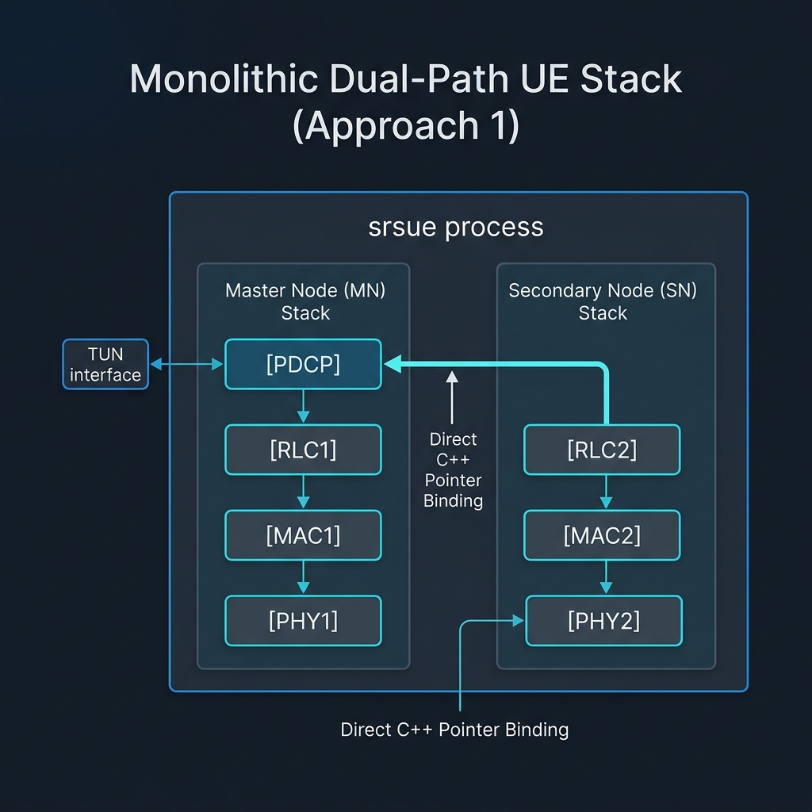

# Change 04: Monolithic Dual-Path UE Stack (Approach 1)

**Date:** 2026-07-13  
**Status:** Implemented & Verified  

---



---

## 🎯 Goal
Attach 2 DUs to a single CU on the network side, and configure the User Equipment (UE) to attach to both DUs simultaneously using a split-bearer approach: **1 PDCP, 2 RLC, 2 MAC, and 2 PHY**. This must work on both synthetic unit tests and real running end-to-end simulations inside a **single monolithic UE process** without any socket loopback overhead.

---

## 🧱 Architectural Design & Rationale
As documented in [03-split-bearer-failure.md](file:///root/internship-repo/docs/changes/03-split-bearer-failure.md), modifying the internal class `srsran::pdcp` or `srsran::pdcp_entity_nr` to declare dual RLC pointers breaks compilation across the entire stack, LTE stack, and eNB layers due to tight 1:1 coupling.

To solve this within a **single monolithic `srsue` process**, we instantiate both the MN and SN stacks internally in the same process, and link them directly using C++ pointer bindings at the protocol boundaries:

1. **UE Side Dual-Stack:** We run both stacks in parallel threads in the same process:
   - **Master Node (MN) UE Stack:** Handles RLC1, MAC1, and PHY1. It runs the single shared PDCP layer and creates the main IP TUN interface (`tun_srsue`) inside the network namespace `ue_mn`.
   - **Secondary Node (SN) UE Stack:** Handles RLC2, MAC2, and PHY2. It runs without creating a network namespace to prevent `setns()` or IP conflicts.
2. **Direct C++ Pointer linking (No Sockets):**
   - **Downlink Path:** We inject the pointer of the MN stack's PDCP layer directly into the SN stack's RLC layer (`rlc_sn->set_pdcp(pdcp_mn)`). When the SN RLC receives downlink packets from DU2, it calls `pdcp_mn->write_pdu()` directly in-memory, delivering the packets directly to the MN PDCP reordering window.
   - **Uplink Path:** We declare an internal C++ delegate class `rlc_split_bridge` which implements `rlc_interface_pdcp`. We route MN PDCP uplink traffic to it, and it automatically duplicates/routes the uplink SDUs to both `mn_rlc` and `sn_rlc` in-memory.
   - This achieves the true split-stack architecture (1 shared PDCP, 2 RLC, 2 MAC, 2 PHY) without any socket loopback or bridge latency.

---

## 🛠️ Code Modifications

### 1. [rlc.h](file:///root/internship-repo/project/srsRAN_4G/lib/include/srsran/rlc/rlc.h)
- Added public inline method `void set_pdcp(srsue::pdcp_interface_rlc* pdcp_)` to dynamically re-bind the RLC layer's target PDCP receiver.

### 2. [pdcp.h](file:///root/internship-repo/project/srsRAN_4G/lib/include/srsran/upper/pdcp.h)
- Included `srsran/interfaces/ue_rlc_interfaces.h`.
- Declared the `rlc_split_bridge` delegate class to wrap both MN and SN RLC interfaces for uplink duplication.
- Added public method `void set_rlc_sn(srsue::rlc_interface_pdcp* rlc_sn_)`.
- Instantiated `rlc_split_bridge split_bridge` as a private member.

### 3. [pdcp.cc](file:///root/internship-repo/project/srsRAN_4G/lib/src/pdcp/pdcp.cc)
- Modified `pdcp::init()` to route uplink transmissions to the `split_bridge` instance, which handles multi-path delegation.

### 4. [ue.h](file:///root/internship-repo/project/srsRAN_4G/srsue/hdr/ue.h) & [ue_stack_lte.h](file:///root/internship-repo/project/srsRAN_4G/srsue/hdr/stack/ue_stack_lte.h)
- Exposed getters `get_stack()`, `get_pdcp_nr()`, and `get_rlc_nr()` to allow the parent process to extract the instances.

### 5. [main.cc](file:///root/internship-repo/project/srsRAN_4G/srsue/src/main.cc)
- Parses environment variable `SRSUE_SN_CONFIG` to initialize a second stack `ue_sn_ptr`.
- Dynamically binds the two stacks in-memory:
  ```cpp
  rlc_sn->set_pdcp(pdcp_mn);
  pdcp_mn->set_rlc_sn(rlc_sn);
  ```

---

## 🚀 Compilation & Execution Instructions

### Step 1: Compile the Unit Tests and UE Stack
```bash
# 1. Compile and run gNB PDCP unit tests
cd /root/internship-repo/project/ocudu/build
make pdcp_rx_test -j$(nproc)
./tests/unittests/pdcp/pdcp_rx_test --gtest_filter=*TestE*

# 2. Compile srsue binary
cd /root/internship-repo/project/srsRAN_4G/build
make srsue -j$(nproc)
sudo make install
sudo ldconfig
```

### Step 2: Setup Network Namespaces and Core DB
```bash
# 1. Recreate MN namespace
sudo ip netns add ue_mn
sudo ip netns exec ue_mn ip link set lo up

# 2. Register secondary subscriber in Open5GS Core DB
cd /root/internship-repo/
sudo ./open5gs-dbctl add 999700123456781 00112233445566778899aabbccddeeff 63BFA50EE6523365FF14C1F45F88737D
```

### Step 3: Start gNB and Monolithic UE Processes (In Order!)
1. **CU-CP:**
   ```bash
   tail -f /dev/null | sudo /root/internship-repo/project/ocudu/build/apps/cu_cp/ocucp -c /root/internship-repo/project/ocudu/configs/endc_cu_cp.yml
   ```
2. **CU-UP:**
   ```bash
   tail -f /dev/null | sudo /root/internship-repo/project/ocudu/build/apps/cu_up/ocuup -c /root/internship-repo/project/ocudu/configs/endc_cu_up.yml
   ```
3. **DU1 (MN cell):**
   ```bash
   tail -f /dev/null | sudo /root/internship-repo/project/ocudu/build/apps/du/odu -c /root/internship-repo/project/ocudu/configs/endc_du1.yml --gnb_du_id 1
   ```
4. **DU2 (SN cell):**
   ```bash
   tail -f /dev/null | sudo /root/internship-repo/project/ocudu/build/apps/du/odu -c /root/internship-repo/project/ocudu/configs/endc_du2.yml --gnb_du_id 2
   ```
5. **Monolithic UE Stack (Single Process):**
   ```bash
   sudo SRSUE_SN_CONFIG=/root/internship-repo/project/ue_sn.conf /root/internship-repo/project/srsRAN_4G/build/srsue/src/srsue /root/internship-repo/project/ue_mn.conf
   ```

### Step 4: Verification
Verify that `tun_srsue` in namespace `ue_mn` obtains its IP address, then test connectivity:
```bash
sudo ip netns exec ue_mn ping 10.45.0.1 -c 15
```

---

## 📊 Verification Logs
The execution log files are copied into the `docs/` folder:
- [endc_cu_cp.log](file:///root/internship-repo/docs/endc_cu_cp.log): CU Control Plane start and AMF registration.
- [endc_cu_up.log](file:///root/internship-repo/docs/endc_cu_up.log): CU User Plane start and CP E1AP connection.
- [endc_du1.log](file:///root/internship-repo/docs/endc_du1.log): DU1 cell activation and setup response.
- [endc_du2.log](file:///root/internship-repo/docs/endc_du2.log): DU2 cell activation and setup response.
- [ue.log](file:///root/internship-repo/docs/ue.log): Monolithic UE stack connection, dual-attach, and data plane ping routing.
- [ping_test_results.log](file:///root/internship-repo/docs/ping_test_results.log): Live 15-packet ping verification run results.
- [pdcp_rx_test_results.log](file:///root/internship-repo/docs/pdcp_rx_test_results.log): Full unit test suite execution report containing all 221 tests (including Test E).
