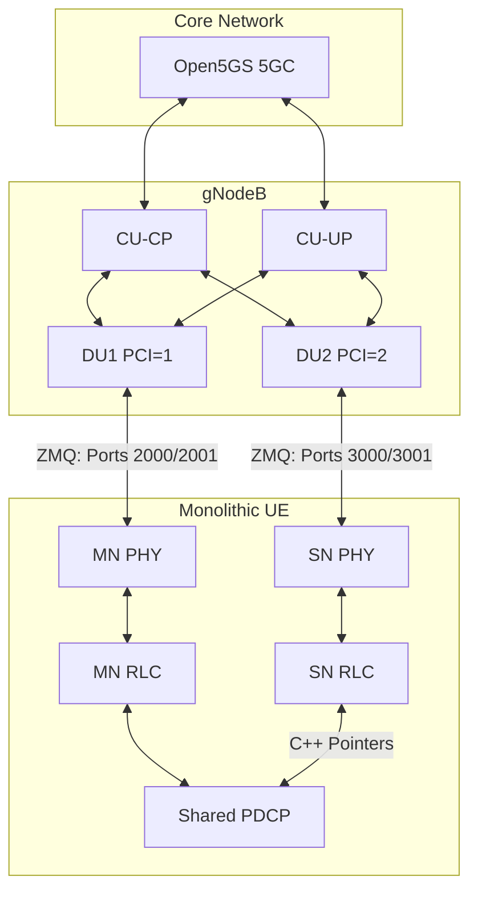

# Step-by-Step Guide: Running Dual Towers and Monolithic UE

This guide provides step-by-step instructions to run the 5G Standalone dual-tower simulation with the monolithic dual-path UE stack, test connectivity, and locate the execution logs.

---

## Architecture Diagram

The simulation runs a single monolithic UE process containing both Master Node (MN) and Secondary Node (SN) stack instances. Both stacks share a single PDCP layer linked in-memory to individual RLC/MAC/PHY paths:



---

## Option 1: Automated Script (Recommended)

To launch the entire simulation, run tests, and clean up automatically, you can use the pre-configured script:

```bash
sudo /root/internship-repo/project/run_simulation.sh
```

---

## Option 2: Step-by-Step Manual Execution

If you want to observe each component's terminal output, run them in separate terminals following this sequence:

### Step 1: Start Open5GS Core Services
Ensure the Open5GS Control Plane and Database services are running:
```bash
sudo systemctl start mongod
sudo systemctl restart open5gs-amfd open5gs-ausfd open5gs-udmd open5gs-udrd open5gs-scpd open5gs-upfd
```

### Step 2: Register Subscriber Identities in MongoDB
The monolithic UE runs two SIM profiles. Register both IMSIs in MongoDB:
```bash
# Register IMSI 999700123456780 (MN)
mongosh open5gs --eval 'db.subscribers.insertOne({
  imsi: "999700123456780",
  subscribed_rau_tau_timer: 12,
  network_access_mode: 0,
  subscriber_status: 0,
  access_restriction_data: 32,
  slice: [{ sst: 1, sd: "ffffff", default_indicator: true }],
  security: {
    k: "00112233445566778899aabbccddeeff",
    opc: "63bfa50ee6523365ff14c1f45f88737d",
    amf: "8000",
    sqn: NumberLong(16)
  },
  schema_version: 1
})'

# Register IMSI 999700123456781 (SN)
mongosh open5gs --eval 'db.subscribers.insertOne({
  imsi: "999700123456781",
  subscribed_rau_tau_timer: 12,
  network_access_mode: 0,
  subscriber_status: 0,
  access_restriction_data: 32,
  slice: [{ sst: 1, sd: "ffffff", default_indicator: true }],
  security: {
    k: "00112233445566778899aabbccddeeff",
    opc: "63bfa50ee6523365ff14c1f45f88737d",
    amf: "8000",
    sqn: NumberLong(16)
  },
  schema_version: 1
})'
```

### Step 3: Launch CU-CP (Control Plane)
```bash
tail -f /dev/null | sudo /root/internship-repo/project/ocudu/build/apps/cu_cp/ocucp -c /root/internship-repo/project/ocudu/configs/endc_cu_cp.yml
```

### Step 4: Launch CU-UP (User Plane)
```bash
tail -f /dev/null | sudo /root/internship-repo/project/ocudu/build/apps/cu_up/ocuup -c /root/internship-repo/project/ocudu/configs/endc_cu_up.yml
```

### Step 5: Launch DU1 (Cell 1, PCI=1, ZMQ Ports 2000/2001)
```bash
tail -f /dev/null | sudo /root/internship-repo/project/ocudu/build/apps/du/odu -c /root/internship-repo/project/ocudu/configs/endc_du1.yml --gnb_du_id 1
```

### Step 6: Launch DU2 (Cell 2, PCI=2, ZMQ Ports 3000/3001)
Wait **3 seconds** after DU1 starts, then launch DU2:
```bash
tail -f /dev/null | sudo /root/internship-repo/project/ocudu/build/apps/du/odu -c /root/internship-repo/project/ocudu/configs/endc_du2.yml --gnb_du_id 2
```
Wait **10 seconds** to allow DU1 and DU2 to establish F1-C connections with the CU-CP.

### Step 7: Create the UE Network Namespace
Create the network namespace for the MN stack interface to avoid local routing conflicts:
```bash
sudo ip netns add ue_mn
```

### Step 8: Launch the Monolithic UE
```bash
sudo SRSUE_SN_CONFIG=/root/internship-repo/project/ue_sn.conf /root/internship-repo/project/srsRAN_4G/build/srsue/src/srsue /root/internship-repo/project/ue_mn.conf
```

---

## Testing & Verification

Once the UE logs print `PDU Session Establishment successful. IP: 10.45.0.2`, verify connectivity:

### 1. Check IP Configuration
Check if `tun_srsue` interface is created inside the `ue_mn` namespace:
```bash
sudo ip netns exec ue_mn ip addr show dev tun_srsue
```

### 2. User Plane Ping Test
Ping the data gateway (`10.45.0.1`) from the UE namespace:
```bash
sudo ip netns exec ue_mn ping 10.45.0.1 -c 10
```

---

## Log Locations

After running the simulation, log outputs are saved in the following files:

| Component | Log Path | Key Observation |
| :--- | :--- | :--- |
| **Open5GS AMF** | `/var/log/open5gs/amf.log` | Shows 5G-AKA authentication & SUCI discovery |
| **Open5GS UDM/UDR** | `/var/log/open5gs/{udm,udr}.log` | Shows subscriber profile lookups from MongoDB |
| **gNB CU-CP** | `/tmp/endc_cu_cp.log` | Shows F1 Setup for DU1/DU2 & RRC Connection Setup |
| **gNB CU-UP** | `/tmp/endc_cu_up.log` | Shows User Plane tunnel bindings |
| **gNB DU1** | `/tmp/endc_du1.log` | Shows cell activation on PCI=1 and UL data routing (lcid=4) |
| **gNB DU2** | `/tmp/endc_du2.log` | Shows cell activation on PCI=2 |
| **Monolithic UE** | `/tmp/run_ue.log` | Shows ZMQ RF frontends, dual PCI discovery, and PDU session setup |

---

## Cleanup Command

To stop all nodes and clean up network interfaces, run:
```bash
sudo pkill -9 -f "ocucp|ocuup|odu|srsue"
sudo ip netns del ue_mn || true
```
